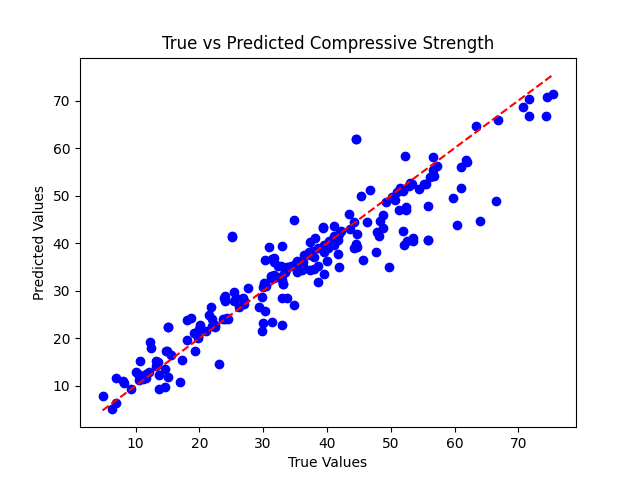

# Concrete Compressive Strength Prediction

A data science project predicting the compressive strength of concrete using Python, with automated visualisations and a predictive ML model.

## Project Overview
This project analyses:
- Features affecting concrete compressive strength (e.g., Cement, Blast Furnace Slag, Fly Ash, etc.)
- A machine learning model (Random Forest) to predict concrete compressive strength
- Evaluation of model performance through various metrics

## Key Features
- **Visualisations**: Automated plot generation (True vs Predicted values)
- **Machine Learning**: Random Forest model to predict compressive strength of concrete
- **Reproducibility**: Full dependency management via `requirements.txt`
- **Model Export**: Save trained model for future use (`concrete_compressive_model.pkl`)
  
## Technical Stack
- **Language**: Python
- **Libraries**: Pandas, Matplotlib, Scikit-learn, joblib
- **Tools**: Git, GitHub, GitPod

## Dataset
The dataset used contains various features related to concrete composition and the corresponding compressive strength. The features include:
- Cement (component 1)(kg in a m^3 mixture)
- Blast Furnace Slag (component 2)(kg in a m^3 mixture)
- Fly Ash (component 3)(kg in a m^3 mixture)
- Water (component 4)(kg in a m^3 mixture)
- Superplasticizer (component 5)(kg in a m^3 mixture)
- Coarse Aggregate (component 6)(kg in a m^3 mixture)
- Fine Aggregate (component 7)(kg in a m^3 mixture)
- Age (day)

### Evaluation Metrics:
- R²: 0.882
- RMSE: 5.510

### Plot Example:
  
*(Example visualization showing True vs Predicted values)*

## How to Run
```bash
# Install dependencies
pip install -r requirements.txt

# Run analysis (trains the model and evaluates)
python analysis.py

# Make predictions (example)
python predict.py --cement 500 --slag 100 --ash 100 --water 200 --superplasticizer 10 --coarse_aggregate 1000 --fine_aggregate 700 --age 28

